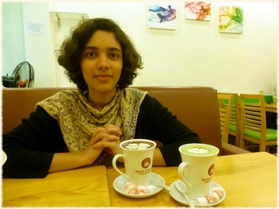

{:#mypicture}

Limited Term Assistant Professor  
Department of Mathematics  
Boyd Graduate Studies Research Center  
University of Georgia  
Athens, GA 30602

**Email:** `asilata` at `uga` dot `edu`  
**Office:** [Boyd](http://www.uga.edu/a-z/location/boyd-graduate-research-studies/) 605  
**Phone:** 706-542-7261

### Research interests and background

My research focuses on problems in representation theory and algebraic geometry. 
I am most interested in the topology and geometry of algebraic varieties arising from representation theory.
Specific topics of interest include perverse sheaves, quiver varieties, equivariant cohomology, and Bernstein--Sato polynomials.
My papers and preprints are on my [research page](/research), and my CV is available [here](assets/bapat-cv.pdf).

I completed my PhD at the [University of Chicago](http://math.uchicago.edu/) in June 2016 under the supervision of Victor Ginzburg.
I was an undergraduate at [MIT](http://web.mit.edu).

### Teaching
In Fall 2016, I am teaching Math 2250 (Calculus I for Science and Engineering).
Older teaching is listed on my [teaching page](teaching/).

### Current and upcoming activities

{{ site.time }}

<ul>

<li>

<strong>{{ activity.display-date }}{{ activity.date | date: "%b %Y" }}:</strong>

{{ activity.content | markdownify | remove: '
' | remove: '
'}}, {{ activity.location | remove: '
' | remove: '
'}}
</li>

</ul>

Older activities are listed on my [activities page](activities/).

